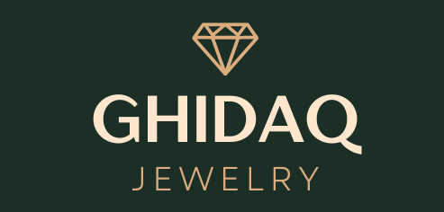

<!-- PROJECT LOGO -->

  

# About: Ghidaq Luxury Jewelry
Ghidaq Luxury Jewelry is a PHP Laravel eCommerce project that provides an online jewelry store with various features. The project includes user authentication for login and registration, a secure checkout process, support for promo codes to offer discounts, and detailed invoices with comprehensive order information. Users can also access their order history to view their past purchases. The project utilizes a MySQL database to store and manage the data. This project aims to create a smooth and enjoyable shopping experience for customers in the world of luxury jewelry.

## Built With

* 
* 

## Getting Started

#### Prerequisites 

* PHP
* Composer
* Laravel
* MySQL
* Web Server (XAMPP)
* Text Editor/IDE (VS Code)

## Installation

To get started with this project, follow the steps below:

1. Install the PHP dependencies by running the following command:

`composer install`

2. Install the JavaScript dependencies by running the following command:

`npm install`

3. Create a copy of the .env.example file and rename it to .env. Or You can use the following command:

`cp .env.example .env`

4. Generate an application key by running the following command:

`php artisan key:generate`

5. Configure the database settings in the .env file with your database credentials.

6. Run the database migrations to create the required tables in the database:

`php artisan migrate`

7. Seed the database with all the necessary data:

`php artisan db:seed`

8. Compile the assets by running the following command:

`npm run dev`

9. Start the development server by running the following command:

`php artisan serve`

That's it! You have successfully installed and set it up. You can now start exploring and using the features of this PHP Laravel project.

#### **Important: Database Seeding Instructions**

To ensure the project functions correctly, it's important to populate the database with initial data, including items and promo codes. Before running the following commands, please make sure you have a working database connection configured.

1. Run the following command to seed the database with items:

**`php artisan db:seed --class=ItemSeeder`**

2. Run the following command to seed the database with promo codes:

**`php artisan db:seed --class=PromoSeeder`**

Alternatively, you can run the following command to seed the database with all the necessary data in one go:

**`php artisan db:seed`**

These commands will populate the database with sample items and promo codes, allowing you to test and explore the project's features.

Feel free to modify the seeders or add more data as needed.

Thank you for using Ghidaq Luxury Jewelry!

