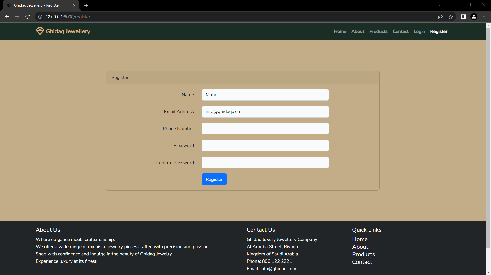
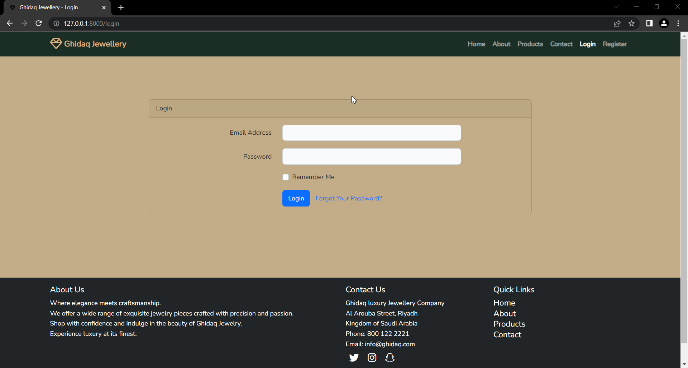
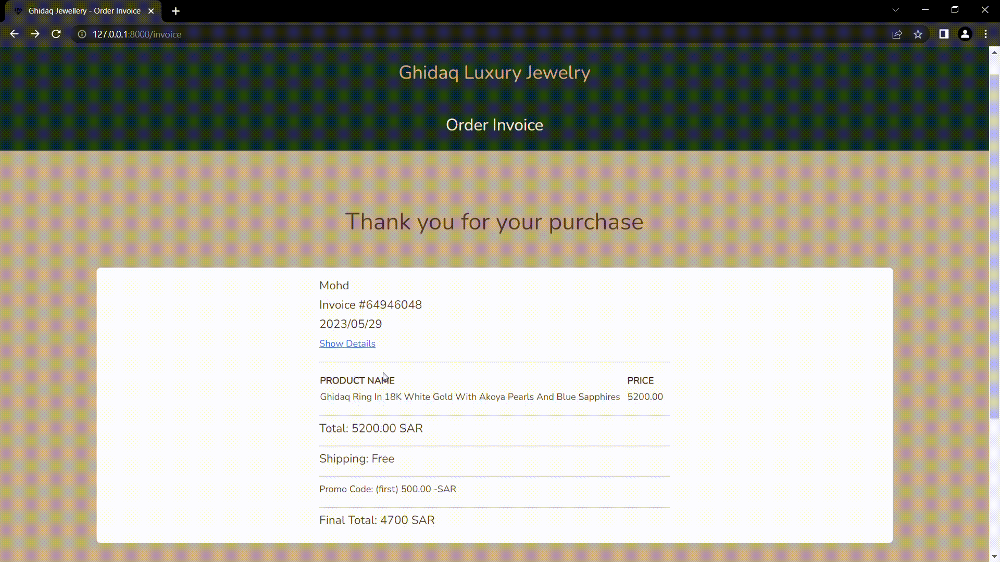
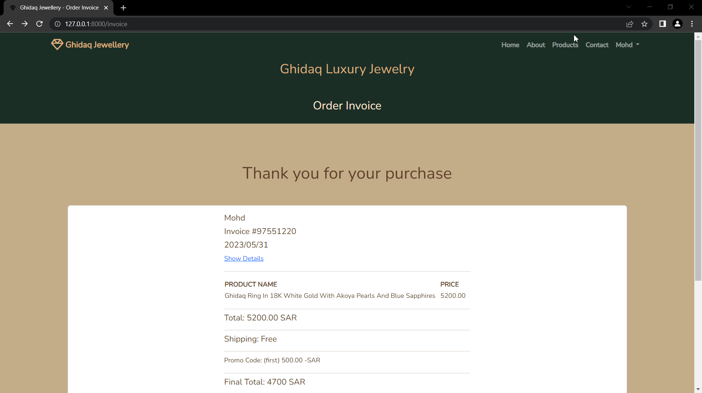

<!-- PROJECT LOGO -->

  

# About:
Ghidaq Luxury Jewelry is a PHP Laravel eCommerce project that provides an online jewelry store with various features. The project includes user authentication for login and registration, a secure checkout process, support for promo codes to offer discounts, and detailed invoices with comprehensive order information. Users can also access their order history to view their past purchases. The project utilizes a MySQL database to store and manage the data. This project aims to create a smooth and enjoyable shopping experience for customers in the world of luxury jewelry.

## Built With

* 
* 

## Main Features

### Home Page

  

On Ghidaq home page, users can navigate through different sections, including Ghidaq Collection, About Us, Our Promise, and Contact Us

---

### Registration

  

To Register, simply click on the "Register" button located in the top-right corner of the page's navbar. This will direct you to the registration form, where you can fill in the required information and submit the form to create your account.

---

### Login 

  

To Login, click on the "Login" button located in the top-right corner of the page's navbar. This will take you to the login form where you can enter your credentials and access your account.

---

### Validation

  

Before allowing users to submit their input, the system performs thorough validation to ensure the accuracy and integrity of the data.

---

### Logout

  

To logout, you can click on the "Logout" button located in the drop-down menu, which is accessible by clicking on your account name at the top-right corner of the page. 

---

### Checkout 

  

To complete the purchase, users must fill out the billing forms on the checkout page.

---

### Invoice 

  

After the checkout, users will be redirected to the invoice page, confirming their successful order. They can click on "Show Details" to view all the additional information about their order.

---

### Orders Page

  

Users can access and view all of their orders by clicking on the My Orders button located in the drop-down menu, which is accessible by clicking on their account name at the top-right corner of the page.

---

<!-- GETTING STARTED -->

## Getting Started

#### Prerequisites 

* PHP
* Composer
* Laravel
* MySQL
* Web Server (XAMPP)
* Text Editor/IDE (VS Code)

## Installation

To get started with this project, follow the steps below:

1. Install the PHP dependencies by running the following command:

`composer install`

2. Install the JavaScript dependencies by running the following command:

`npm install`

3. Create a copy of the .env.example file and rename it to .env. Or You can use the following command:

`cp .env.example .env`

4. Generate an application key by running the following command:

`php artisan key:generate`

5. Configure the database settings in the .env file with your database credentials.

6. Run the database migrations to create the required tables in the database:

`php artisan migrate`

7. Seed the database with all the necessary data:

`php artisan db:seed`

8. Compile the assets by running the following command:

`npm run dev`

9. Start the development server by running the following command:

`php artisan serve`

That's it! You have successfully installed and set it up. You can now start exploring and using the features of this PHP Laravel project.

#### **Important: Database Seeding Instructions**

To ensure the project functions correctly, it's important to populate the database with initial data, including items and promo codes. Before running the following commands, please make sure you have a working database connection configured.

1. Run the following command to seed the database with items:

**`php artisan db:seed --class=ItemSeeder`**

2. Run the following command to seed the database with promo codes:

**`php artisan db:seed --class=PromoSeeder`**

Alternatively, you can run the following command to seed the database with all the necessary data in one go:

**`php artisan db:seed`**

These commands will populate the database with sample items and promo codes, allowing you to test and explore the project's features.

Feel free to modify the seeders or add more data as needed.

Thank you for using Ghidaq Luxury Jewelry!

